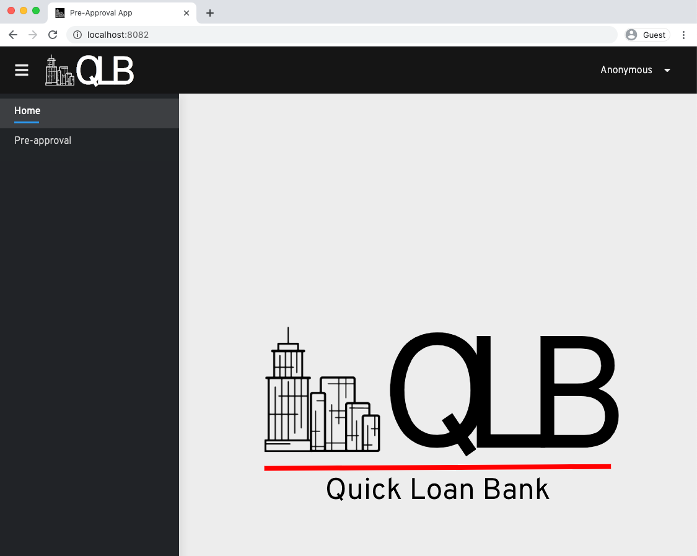
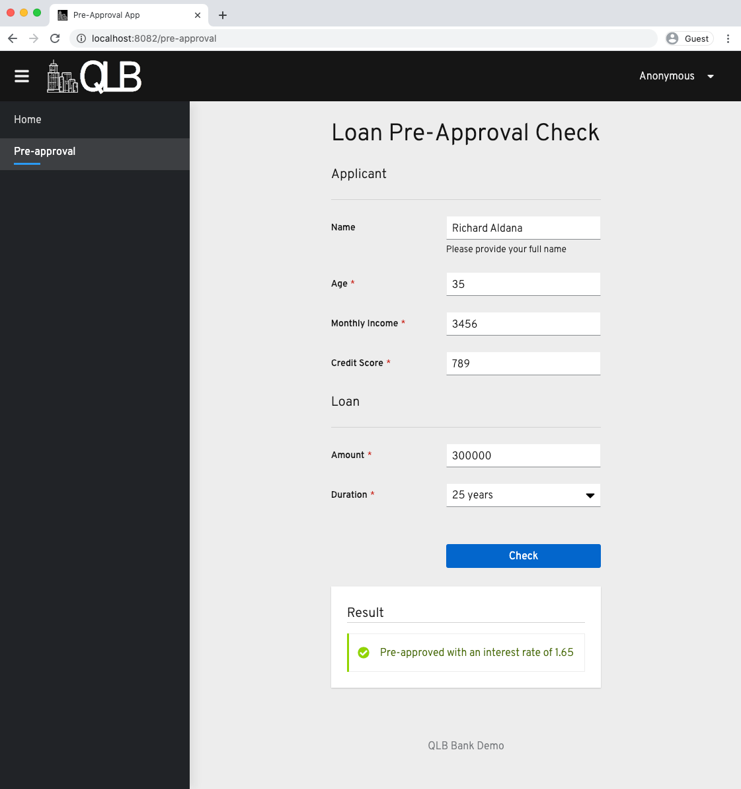

# QLB UI

This project use [Vert.x](https://quarkus.io/guides/vertx) and [Quarkus](https://quarkus.io/) , to render a React Application

## Running the application in dev mode

You can run your application in dev mode that enables live coding using:

```
mvn quarkus:dev
```

Note: Live coding of the React JS frontend application is not yet in place.

## Packaging and running the application

The application is packageable using:

```
mvn package
```

It produces the executable `qlb-ui-1.0-runner.jar` file in `/target` directory.
Be aware that it’s not an _über-jar_ as the dependencies are copied into the `target/lib` directory.

The application is now runnable using:

```
java -jar target/qlb-ui-1.0-runner.jar
```

Open [http://localhost:8082](http://localhost:8082) to view it in the browser.





## Creating a native executable

You can create a native executable using:

```
mvn package -Dnative
```

Or you can use Docker to build the native executable using:

```
mvn package -Dnative -Dquarkus.native.container-build=true
```

You can then execute your binary: `./target/qlb-ui-1.0-runner.jar`

If you want to learn more about building native executables, please consult https://quarkus.io/guides/building-native-image-guide .

## Packaging together with the React app

The application makes use of a separately developed [QLB React App](../packages/qlb-react-app/package.json). The JS based frontend can be built as part of the build of this project by using the `ui` profile, invoked using

```
mvn package -Dui
```

To prepare all the dependencies needed for the build of UI, there's a maven profile activated by `ui.deps` property being specified that user need to run before the actual build.

The single command to activate both profiles is:

```
mvn package -Dui.deps -Dui
```

## Creating a native executable

The native build of the application bundling in the React JS frontend does not differ from the instructions above. The only thing that's new is again the invocation of UI specific profiles.

```
mvn package -Dui -Dnative
```
